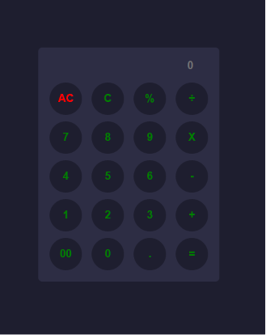

# 🧮 Calculator App

A simple and responsive calculator built using **HTML, CSS, and JavaScript**.

## 🚀 Features

- ➕ Addition
- ➖ Subtraction
- ✖️ Multiplication
- ➗ Division
- 🧹 Clear Button
- 📱 Responsive Design

## 🛠️ Technologies Used

- HTML5
- CSS3
- JavaScript

## 📂 Project Structure

```
calculator/
│── index.html
│── style.css
│── index.js
```

## 📸 Screenshot



## 👨‍💻 Author

**Kuldeep Kumar**

- GitHub: https://github.com/kuldeepmaurya7
- LinkedIn: https://www.linkedin.com/in/kuldeepkumar-dotnet

⭐ If you like this project, don't forget to star the repository.
